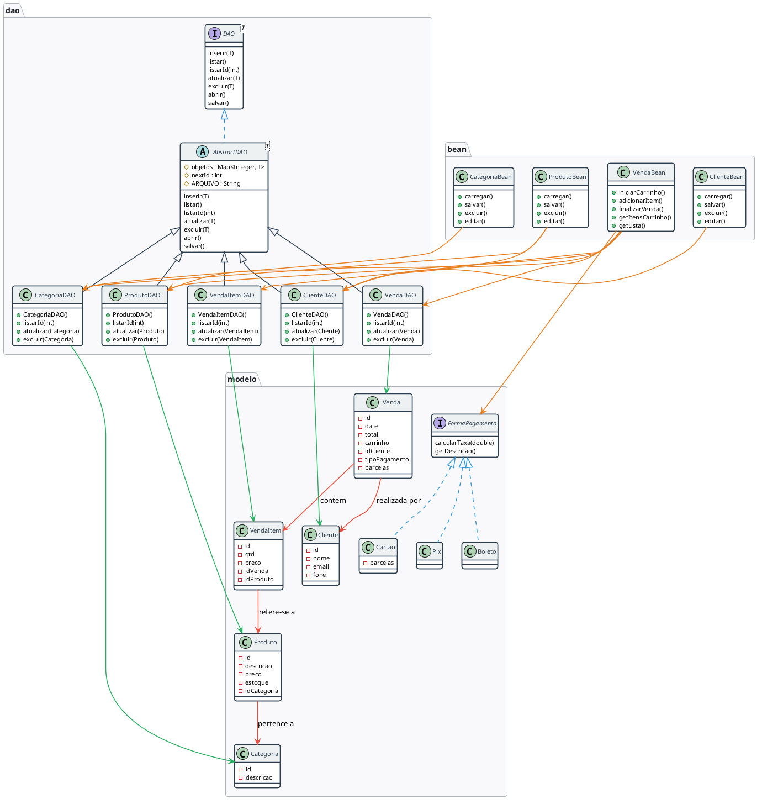

# Sistema de Comercio Eletronico

Sistema de gerenciamento para e-commerce desenvolvido em **Java 21** com **Jakarta Faces 4.0**, seguindo o padrao DAO com persistencia em arquivos JSON via Jackson.

## Funcionalidades

- **Clientes:** CRUD completo com nome, e-mail e telefone.
- **Categorias:** Organizacao de produtos por categoria.
- **Produtos:** Catalogo com preco, estoque e vinculo com categoria.
- **Vendas:** Carrinho de compras, selecao de forma de pagamento (Boleto, Cartao, Pix) com calculo de taxas/descontos, e baixa no estoque.

## Estrutura do Projeto

```
src/main/java/
├── dao/           Interface DAO<T>, classe abstrata AbstractDAO<T> e 5 DAOs concretos
├── modelo/        Entidades do dominio (Categoria, Cliente, Produto, Venda, VendaItem)
├── modelo/pagamento/  Interface FormaPagamento + implementacoes (Boleto, Cartao, Pix)
├── bean/          Managed Beans JSF (CategoriaBean, ClienteBean, ProdutoBean, VendaBean)
└── exception/     Excecoes personalizadas (NaoEncontrada para cada entidade)

src/main/webapp/
├── clientes/      Paginas XHTML para CRUD de clientes
├── categorias/    Paginas XHTML para CRUD de categorias
├── produtos/      Paginas XHTML para CRUD de produtos
└── vendas/        Paginas XHTML para carrinho e listagem de vendas
```

## Tecnologias

| Tecnologia | Versao |
|------------|--------|
| Java | 21 |
| Jakarta Faces (JSF) | 4.0.6 |
| CDI (Weld) | 5.1.2 |
| Servlet | 6.0 |
| Jackson | 2.15.2 |
| Maven | 3.9+ |
| Tomcat | 10.1+ |

## Como Executar

### Com Docker (recomendado)

```bash
# Build e executa
docker compose up --build

# Acesse em http://localhost:8080
```

### Com Podman (Linux)

```bash
# Build e executa (alias podman-compose ou docker-compose)
podman compose up --build

# Acesse em http://localhost:8080
```

> Dica: No Linux, `podman compose` aceita os mesmos comandos do `docker compose`. Certifique-se de ter o `podman-compose` instalado (`sudo dnf install podman-compose` no Fedora ou `sudo apt install podman-compose` no Ubuntu/Debian).

### Sem Docker (desenvolvimento local)

**Pre-requisitos:** JDK 21, Maven 3.9+, Tomcat 10.1+

```bash
# Compilar e empacotar
mvn clean package

# O arquivo target/ComercioEletronico.war sera gerado
# Copie para a pasta webapps/ do Tomcat 10.1+ e inicie o servidor

# Acesse em http://localhost:8080/ComercioEletronico/
```

### Deploy no Render

O Dockerfile ja esta configurado para deploy como **ROOT.war** no Tomcat, tornando a aplicacao acessivel na raiz do dominio. Basta conectar o repositorio ao Render como servico web usando o Dockerfile.

## Diagrama UML



### Legenda das setas

| Cor | Relacao |
|-----|---------|
| Azul (tracejado) | Realizacao de interface (`implements`) |
| Preto (solido) | Heranca (`extends`) |
| Verde | DAO gerencia entidade |
| Laranja | Bean utiliza DAO |
| Vermelho | Relacionamento entre entidades (FK)
