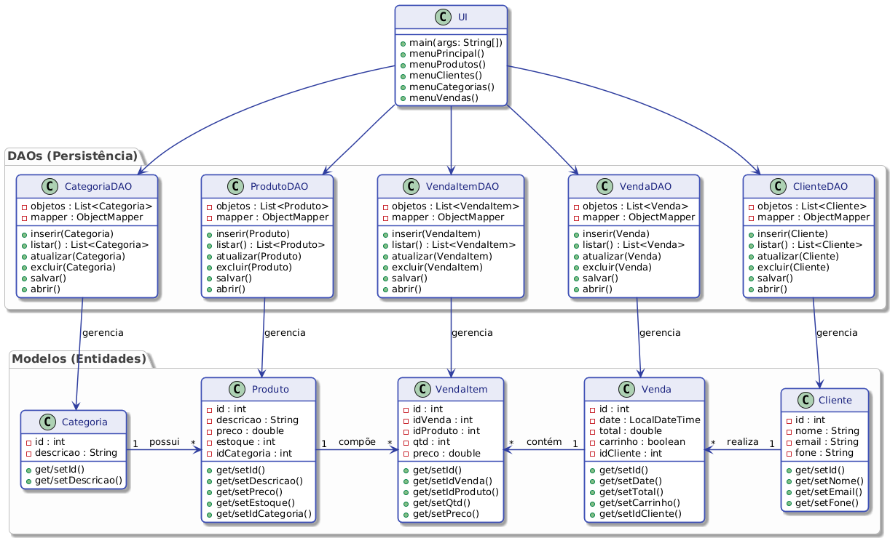

# Sistema de Comércio Eletrônico

Este projeto consiste em um sistema de gerenciamento para e-commerce, desenvolvido em **Java** como parte da disciplina de Programação Orientada a Objetos. O sistema implementa o padrão de projeto DAO (Data Access Object) para persistência de dados e utiliza a biblioteca Jackson para serialização/desserialização de objetos em formato JSON.

## Funcionalidades

O sistema permite o gerenciamento completo (CRUD) das seguintes entidades:

* **Clientes:** Cadastro, listagem, atualização e exclusão de dados cadastrais.
* **Produtos:** Gerenciamento de catálogo, incluindo preço, estoque e vínculo com categorias.
* **Categorias:** Organização de produtos por categorias.
* **Vendas:** Registro de pedidos e itens vinculados.

## Estrutura do Projeto

O projeto foi organizado seguindo boas práticas de desenvolvimento Java, com a separação de responsabilidades em pacotes:

* `modelo`: Classes que definem as entidades do domínio (POJOs).
* `dao`: Classes responsáveis pela persistência dos dados e lógica de acesso.
* `ui`: Interface de linha de comando para interação com o usuário.

## Tecnologias Utilizadas

* **Linguagem:** Java (versão 21)
* **Gerenciador de Dependências:** Apache Maven
* **Persistência:** Jackson (jackson-databind) para manipulação de arquivos JSON

## Pré-requisitos

Para executar o projeto, é necessário ter instalado:

* JDK (Java Development Kit) 21 ou superior.
* Apache Maven.

## Como Executar

1. Clone o repositório para sua máquina local.
2. No diretório raiz do projeto, certifique-se de que o arquivo `pom.xml` está configurado corretamente.
3. Compile o projeto via terminal ou IDE:
```bash
mvn clean compile

```


4. Execute a classe `UI.java` localizada no pacote `ui`.

## Diagrama de Arquitetura




## Contribuidores

* [Gustavo Jácome]